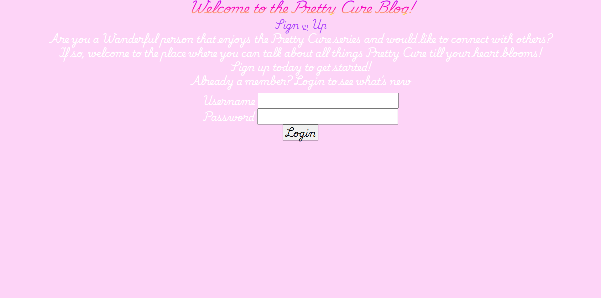
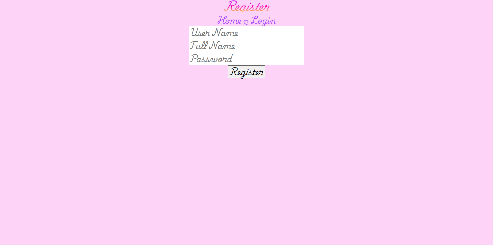
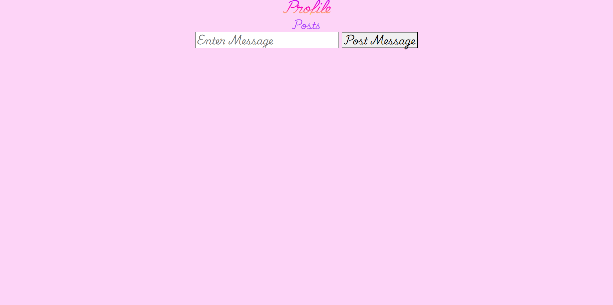
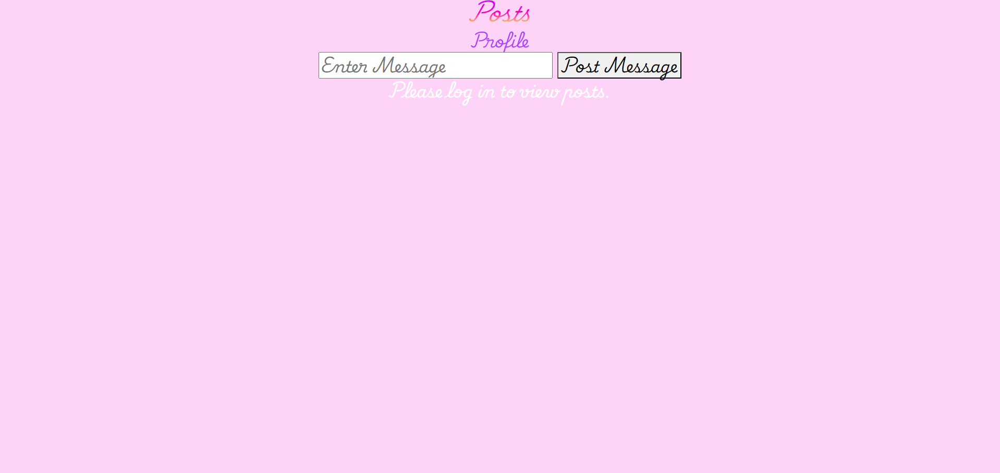
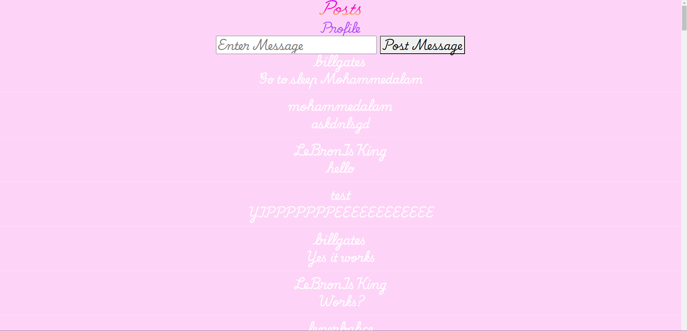

# Enjoy the Microblog Project and the MicroblogLite API!

Don't forget to read the [*MicroblogLite* API docs](http://microbloglite.us-east-2.elasticbeanstalk.com/docs) and experiment with the API in *Postman!*

Practice and experimentation provide experience, and experience provides confidence.

Pretty Cure Blog

Microblog Network Capstone 3 Project 6/28/2024

A mini web blog with girly aestheic where posts can be seen and made by a logged in user.

My favorite part of this project is how we got to post a message to the blog.

function postMessage() {
        const loginData = getLoginData(); // Retrieve login data
        if (!loginData.token) {
            console.error("No authorization token found.");
            alert("You must be logged in to post a message.");
            return;
        }

        const message = messageTextarea.value.trim();
        if (!message) {
            alert("Message cannot be empty.");
            return;
        }

        const postData = {
            text: message
        };

        fetch(apiBaseURL + "/api/posts", {
            method: "POST",
            headers: {
                "Content-Type": "application/json",
                "Authorization": `Bearer ${loginData.token}`
            },
            body: JSON.stringify(postData)
        })
            .then(response => response.json())
            .then(post => {
                console.log("Post created successfully:", post);
                messageTextarea.value = ''; // Clear the text area
                fetchPosts(); // Refresh the posts
            })
            .catch(error => {
                console.error("Error posting message:", error);
                alert("Failed to post message.");
            });
    }
    // Event listener for the submit button
    submitButton.addEventListener("click", function (event) {
        event.preventDefault(); // Prevent form submission
        postMessage();
    });

    fetchPosts();
});

I've always wondered how it was done.